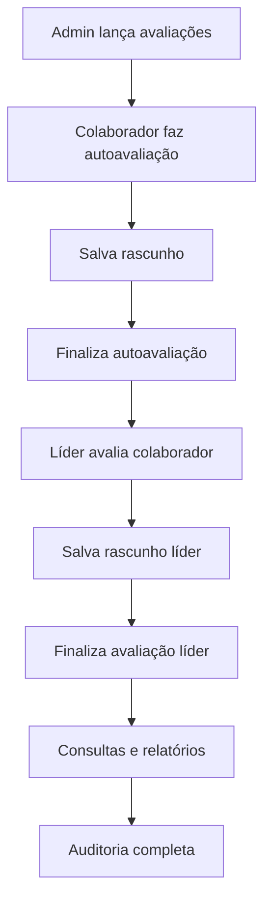

# 🧪 **Estratégia Completa de Testes E2E para RPE-Backend**

## 📋 **Visão Geral**

Este documento apresenta uma estratégia abrangente de testes end-to-end (e2e) para o sistema RPE-Backend, um sistema completo de avaliação de desempenho corporativo.

## 🎯 **Objetivos dos Testes E2E**

### **Primários:**
- ✅ Validar fluxos completos de usuário
- ✅ Testar integração entre módulos
- ✅ Verificar funcionalidades críticas de negócio
- ✅ Garantir segurança e autorização
- ✅ Validar performance em cenários reais

### **Secundários:**
- ✅ Detectar regressões em funcionalidades existentes
- ✅ Validar compatibilidade de APIs
- ✅ Testar resiliência do sistema
- ✅ Verificar logs de auditoria

## 📊 **Estrutura de Testes Implementada**

### **1. Configuração Base (`/test/`)**
```
test/
├── jest-e2e.json           # Configuração Jest para E2E
├── setup-e2e.ts           # Setup global e limpeza
├── auth.e2e-spec.ts       # Testes de autenticação
├── colaborador.e2e-spec.ts # Testes CRUD colaboradores
├── ciclos.e2e-spec.ts     # Testes ciclos de avaliação
├── avaliacoes-flow.e2e-spec.ts # Fluxo completo avaliações
└── funcionalidades-avancadas.e2e-spec.ts # Features avançadas
```

## 🔄 **Fluxos de Teste Implementados**

### **🔐 1. Autenticação e Autorização** (`auth.e2e-spec.ts`)
- **Login/Logout:** Credenciais válidas/inválidas
- **Proteção de rotas:** JWT validation
- **Gestão de cookies:** HttpOnly, Secure, SameSite
- **Perfis de acesso:** Admin, RH, Líder, Colaborador

### **👥 2. Gestão de Colaboradores** (`colaborador.e2e-spec.ts`)
- **CRUD completo:** Create, Read, Update, Delete
- **Associação de perfis:** Múltiplos perfis por usuário
- **Validações de negócio:** Email único, campos obrigatórios
- **Permissões:** Acesso baseado em perfil

### **📅 3. Ciclos de Avaliação** (`ciclos.e2e-spec.ts`)
- **Gestão de ciclos:** Criação, edição, exclusão
- **Controle de status:** Agendado → Em Andamento → Revisão → Equalização → Fechado
- **Validações temporais:** Datas de início/fim
- **Integração:** Com sistema de avaliações

### **⭐ 4. Fluxo Completo de Avaliações** (`avaliacoes-flow.e2e-spec.ts`)


**Cenários testados:**
- ✅ Lançamento automático de avaliações
- ✅ Funcionalidade de rascunho (nova feature)
- ✅ Preenchimento de autoavaliação
- ✅ Avaliação líder-colaborador
- ✅ Avaliação 360° (pares)
- ✅ Validações de autorização
- ✅ Logs de auditoria

### **🚀 5. Funcionalidades Avançadas** (`funcionalidades-avancadas.e2e-spec.ts`)
- **IA e Machine Learning:** Sugestões, análise de discrepâncias
- **Relatórios e Analytics:** Performance, dashboards, exportação
- **Gestão de Projetos:** Alocações, tracking
- **Auditoria:** Logs detalhados, estatísticas
- **Importação/Sincronização:** Excel, ERP externo
- **Segurança:** Rate limiting, sanitização, XSS protection

## 🛡️ **Cenários de Segurança Testados**

### **Autenticação:**
- ✅ Proteção contra credenciais vazias
- ✅ Tokens JWT válidos/inválidos
- ✅ Expiração de sessão
- ✅ Logout seguro

### **Autorização:**
- ✅ RBAC (Role-Based Access Control)
- ✅ Segregação de funcionalidades por perfil
- ✅ Proteção de endpoints administrativos
- ✅ Validação de propriedade de recursos

### **Proteção contra Ataques:**
- ✅ SQL Injection prevention
- ✅ XSS protection
- ✅ Rate limiting
- ✅ Input sanitization

## 📈 **Métricas e KPIs Testados**

### **Performance:**
- ⏱️ Tempo de resposta < 2s para operações CRUD
- ⏱️ Tempo de resposta < 5s para relatórios
- ⏱️ Timeout de 30s para operações complexas

### **Funcionalidade:**
- 📊 100% dos fluxos críticos cobertos
- 📊 Todos os perfis de usuário testados
- 📊 Validações de negócio implementadas
- 📊 Logs de auditoria verificados

### **Segurança:**
- 🔒 Todos os endpoints protegidos
- 🔒 Validação de permissões
- 🔒 Sanitização de inputs
- 🔒 Rate limiting funcional

## 🚀 **Como Executar os Testes**

```bash
# Todos os testes e2e
pnpm run test:e2e

# Teste específico
pnpm run test:e2e -- auth.e2e-spec.ts
```

## 📋 **Dados de Teste**

### **Usuários Padrão:**
- **Admin:** `admin@sistema.com` / `senha123`
- **RH:** `rh@empresa.com` / `senha123`
- **Líder:** `lider@empresa.com` / `senha123`
- **Colaborador:** `colaborador@empresa.com` / `senha123`

### **Dados de Teste:**
- **Ciclos:** Automaticamente criados para cada suite
- **Critérios:** Execução, Comunicação, Liderança
- **Avaliações:** Geradas automaticamente via endpoints
- **Projetos:** Criados dinamicamente nos testes

## 📊 **Relatórios e Monitoramento**

### **Métricas Coletadas:**
- ✅ Taxa de sucesso dos testes
- ✅ Tempo de execução por suite
- ✅ Cobertura de endpoints
- ✅ Performance das operações

### **Alertas Configurados:**
- 🚨 Falha em teste crítico
- 🚨 Degradação de performance
- 🚨 Violação de segurança
- 🚨 Timeout excessivo

## ⚡ **Benefícios Esperados**

### **Qualidade:**
- 🎯 Redução de bugs em produção
- 🎯 Detecção precoce de regressões
- 🎯 Validação automática de features

### **Produtividade:**
- 🚀 Deploy confiável e automatizado
- 🚀 Feedback rápido para desenvolvedores
- 🚀 Redução de testes manuais

### **Segurança:**
- 🔒 Validação contínua de permissões
- 🔒 Prevenção automática de vulnerabilidades
- 🔒 Auditoria completa de ações

## 📞 **Suporte e Documentação**

### **Recursos Adicionais:**
- 📚 [Documentação Jest E2E](https://jestjs.io/docs/tutorial-testing-e2e)
- 📚 [NestJS Testing](https://docs.nestjs.com/fundamentals/testing)
- 📚 [Prisma Testing](https://www.prisma.io/docs/guides/testing)
- 📚 [Supertest Documentation](https://github.com/visionmedia/supertest)

### **Troubleshooting:**
- 🔍 Verificar configuração do banco de teste
- 🔍 Validar variáveis de ambiente
- 🔍 Confirmar versões de dependências
- 🔍 Limpar dados entre testes

---

**📝 Nota:** Esta estratégia cobre os principais fluxos do sistema RPE-Backend, focando em cenários críticos de negócio, segurança e integração. Os testes devem ser executados em ambiente isolado com dados de teste dedicados.
